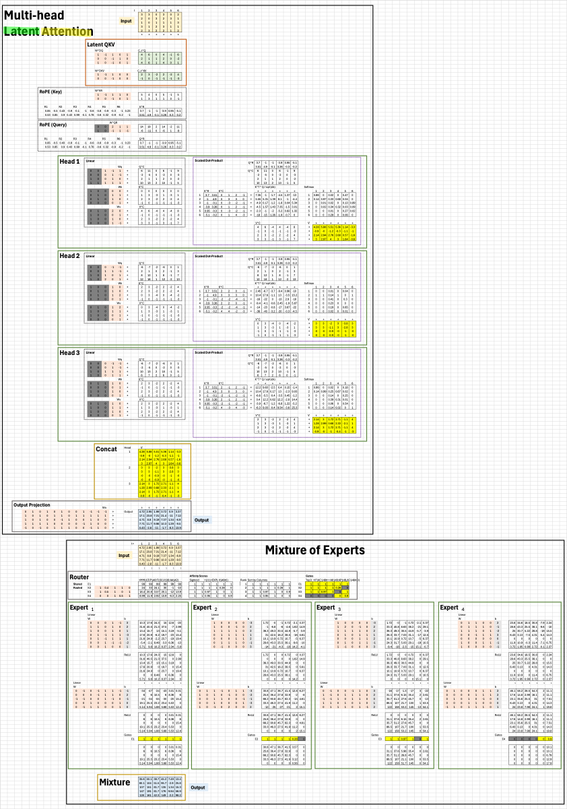

# ai-by-hand-excel

AI by Hand ✍️ Exercises in Excel

## Basic
* Softmax
* LeakyReLU
* Temperature

## Advanced
* Multi Layer Perceptron (MLP)
* Backpropagation
* Recurrent Neural Network (RNN)
* Long Short Term Memory (LSTM) (+ Seq2Seq)
* Extended Long Short Term Memory (xLSTM)
* Residual Network (ResNet)
* Transformer - Simple
* Transformer - Full Stack
* Self-Attention
* Multihead Attention
* Autoencoder (AE)
* Mamba
* AlphaFold

## Lectures

### 🔥 NEW: DeepSeek 
Multi-head Latent Attention + Mixture of Experts
(blank only)

[View](https://o365coloradoedu-my.sharepoint.com/:x:/g/personal/peye9704_colorado_edu/EfAlZg6tnotMtEb3N0TA_98BWFdAiqD24mc-MqETTDoVUQ?e=dh4Ncq)
| [Download](lectures/DeepSeek-blank.xlsx)

## Workbook
1. Dot Product
2. Matrix Multiplication
3. Linear Layer

## Coming Soon
* Generative Adversarial Network (GAN)
* Variational Autoencoder (VAE)
* U-Net
* CLIP
* more ...
