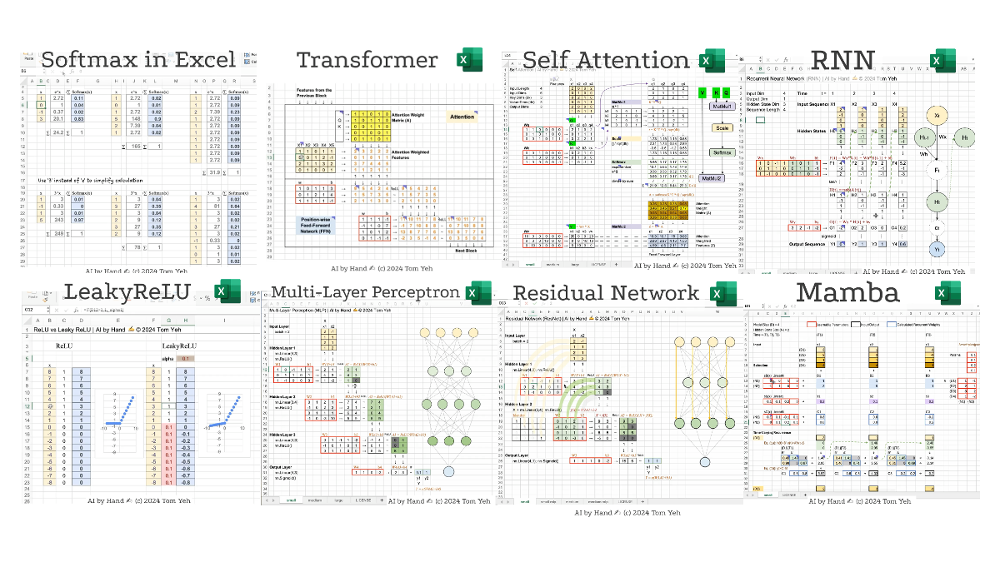

# ai-by-hand-excel

AI by Hand ✍️ Exercises in Excel

## Basic
* Softmax
* LeakyReLU
* Temperature

## Advanced
* Multi Layer Perceptron (MLP)
* Backpropagation
* Recurrent Neural Network (RNN)
* Long Short Term Memory (LSTM) (+ Seq2Seq)
* 🔥 NEW: Extended Long Short Term Memory (xLSTM)
* Residual Network (ResNet)
* Transformer - Simple
* Transformer - Full Stack
* Self-Attention
* 🔥 NEW: Multihead Attention
* Autoencoder (AE)
* Mamba
* AlphaFold

## Workbook
1. Dot Product
2. Matrix Multiplication
3. Linear Layer

## Coming Soon
* Generative Adversarial Network (GAN)
* Variational Autoencoder (VAE)
* U-Net
* CLIP
* more ...
